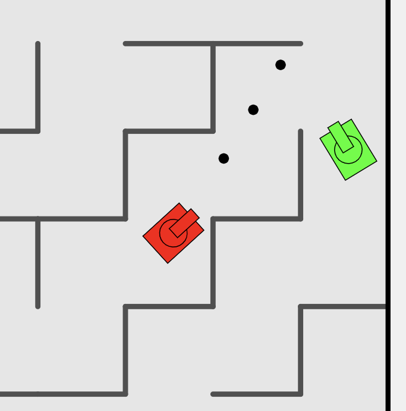

# tank-troublesome

This is a clone of the game "Tank Trouble."  I made this because the collisions in the original game never seemed to work correctly, so I gave it a try myself.  This version has more consistent (and fairly optimized) collision handling and random maze generation, but does not yet have any powerups.

To run this project, download the files and open [index.html](index.html) in a browser.

Controls:
 - Tank 1: ESDF to move, Q to fire
 - Tank 2: Arrow keys to move, M to fire

The goal of the game is to destroy the other tank by firing bullets which bounce around the maze.  But be careful because your bullets will also destroy your own tank!

